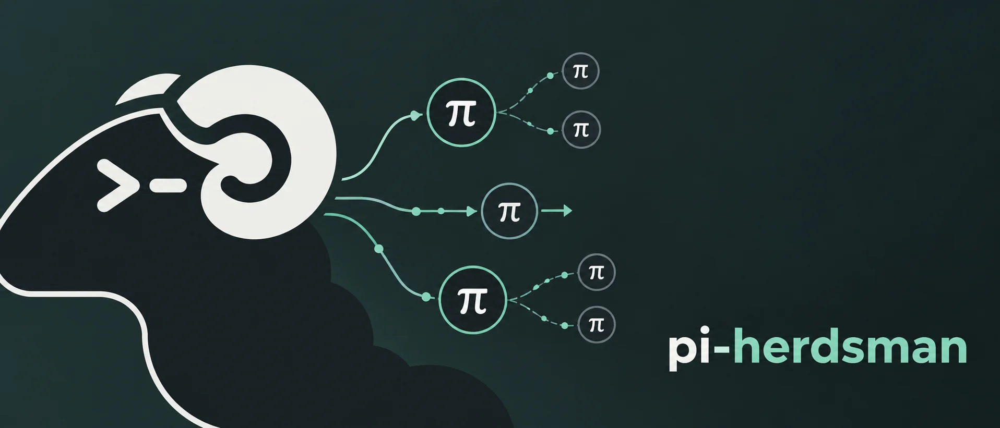

# Pi Herdsman 🐏



[](https://www.npmjs.com/package/pi-herdsman)
[](https://github.com/boadij/pi-herdsman/actions/workflows/validate.yml)
[](https://github.com/boadij/pi-herdsman/actions/workflows/validate.yml)
[](LICENSE)

**Asynchronous [Pi](https://github.com/earendil-works/pi) subagents and agent fleet orchestration for parallel coding agents with nested delegation, background work, and supervision in [herdr](https://github.com/herdrdev/herdr).**

Keep the conversation. Delegate the work.

Pi Herdsman is a Pi extension for asynchronous subagents and multi-agent
coding. Delegate coding tasks to managed background agents running in
independent Pi sessions while the lead conversation stays interactive. Run
coding agents in parallel, nest delegation, steer active agents, route
questions and results back to their owning agent, and supervise multiple leads
through one coordinated hierarchy.

Use it in an existing Pi/herdr setup or deploy the SSH-ready container as a
portable remote coding-agent environment. [herdr Machines](https://herdr.dev/docs/connecting-machines/)
can bring local and remote workspaces and agents into one herdr window over
normal SSH.

Pi Herdsman calls its managed subagents **agents**.

```text
You ↔ lead
      ├─ agent
      │  └─ agent
      └─ agent
```

A lead and its nested agent hierarchy form a herd, Herdsman's model of an
agent fleet.

Pi Herdsman is opinionated about coordination, not workflow. A lead owns its
agents, and a delegation-enabled agent may own permitted agents of its own.
Agent definitions, models, tools, extensions, and development process remain up
to you.

## Demo


## Install

### Linux / macOS bootstrap

Install the released, tested Pi / Herdr / Pi Herdsman stack:

```sh
curl -fsSL https://raw.githubusercontent.com/boadij/pi-herdsman/main/install.sh | sh
```

The bootstrapper requires Node `>=22.19.0` and npm. It reconciles the exact Pi
and Herdr versions declared by the current Pi Herdsman release, installs Pi
Herdsman as an updateable Pi package, verifies the Herdr download, and refreshes
the Herdr Pi integration. Re-run it to update or repair the stack.

### Existing Pi / herdr

```sh
pi install npm:pi-herdsman
herdr integration install pi
```

Start Herdr in your project:

```sh
herdr
```

Then run Pi in the Herdr pane:

```sh
pi
```

### Docker / remote machine

For a self-contained, SSH-ready remote coding-agent environment, see
[Container deployment](docs/guides/container-deployment.md).

Once normal SSH access works, the same container can be saved as a herdr
machine:

```sh
herdr machine add ssh://herdsman@host:2222 --label my-herd
```

A host defined in normal SSH configuration can be used directly instead.

## Try it

Ask Pi normally:

```text
Use scout to inspect this repository.
```

That's enough. The agent runs asynchronously while the lead conversation remains
available.

Other useful requests look the same:

```text
Use scout to map the authentication flow.
Have researcher verify the current upstream API behavior.
Have reviewer inspect this diff for correctness and unnecessary complexity.
Run scout and researcher independently while we continue planning here.
```

Open the human agent management surface at any time with:

```text
/agents
```

To supervise independent leads across the current herdr runtime, use:

```text
/chief
```

Chief supervision is separate from ownership:

```text
chief
  ├─ herd A / lead A
  │  └─ agents...
  └─ herd B / lead B
     └─ agents...
```

Leave chief mode with:

```text
/chief leave
```

See [supervision](docs/concepts/supervision.md) and the
[supervision reference](docs/reference/supervision.md).

For the complete walkthrough, see [Getting started](docs/getting-started.md).

## Why Pi Herdsman?

- **Async subagents by default.** Assignments return after acceptance while agents keep
  running and the owning lead session remains available. Results and owner
  questions return when they need attention.
- **One assignment per agent.** Each managed agent generation handles one
  bounded assignment, delivers its terminal result, and is cleaned up. Continue
  completed context with `agent_continue` and the exact returned Pi session.
- **Nested multi-agent orchestration.** Delegation-enabled agents can own and manage
  permitted agents themselves. Identity, ownership, steering, clarification,
  results, and cleanup share the same lifecycle across the hierarchy.
- **Your workflow stays yours.** Use the bundled portable roles, override them,
  or bring your own definitions, models, tools, extensions, and process. Pi
  Herdsman does not prescribe a plan, implementation, or review workflow.
- **Small and disciplined.** Pi Herdsman focuses on orchestration semantics.
  herdr manages physical sessions and placement; Pi keeps owning each
  conversation and turn state.

See [Lifecycle](docs/concepts/lifecycle.md) for the exact asynchronous contract.

## How it works

Pi Herdsman deliberately separates three responsibilities:

- **herdr** owns physical agent lifecycle and placement.
- **Pi Herdsman** owns assignment, clarification, result, and control
  coordination.
- **Pi** owns each session and turn state.

The model-facing coordination tools are operation-specific: `agent_list`,
`agent_delegate`, `agent_continue`, `agent_steer`, `agent_interrupt`,
`agent_reply`, `agent_close`, `agent_inspect`, and `agent_transcript` manage
owned agents; `supervisor_message` and `supervisor_ask` contact the direct
supervisor; `peer_list` and `peer_message` coordinate between ordinary Leads;
`staff_list`, `staff_inspect`, `staff_transcript`, `staff_message`, and
`staff_reply` let the active Chief supervise Leads. Managed agents can use
`ask_owner` to ask their exact owner. Peer and staff targets use exact Pi
session IDs in `session`. Agent labels are not continuation handles: use the
exact Pi session ID with `agent_continue`. A continued session reuses its saved
logical label. Exact herdr identifiers are validation evidence behind live
agent and lead identity.

Bundled definitions are portable defaults, not required workflow stages. Global
definitions can override them or add new roles with your preferred models,
tools, extensions, skills, and instructions.

## Requirements

- [herdr](https://github.com/herdrdev/herdr) `>=0.9.1`
- Pi `>=0.87.0 <0.88.0` (supported)
- Node `>=22.19.0`

Package CI validates the minimum supported Node 22.19.0 runtime. The container
separately ships and validates Node 26.

Install or refresh the herdr Pi integration:

```sh
herdr integration install pi
herdr integration status
```

The package manifest loads the bundled extension and exposes the optional
`agents` skill.

## Compatible extensions

Pi Herdsman interoperates with optional Pi extensions without depending on
them:

- [pi-web-access](https://github.com/nicobailon/pi-web-access) — the bundled
  `researcher` recognizes its standard web-research tools.
- [pi-permission-system](https://github.com/gotgenes/pi-packages/tree/main/packages/pi-permission-system)
  — shared agent frontmatter, active-agent identity, and subagent lineage
  conventions support per-agent permission policy.

Neither extension is required or installed by Pi Herdsman.

## Community

Questions, workflows, examples, and ideas are welcome in [GitHub Discussions](https://github.com/boadij/pi-herdsman/discussions).

For reproducible bugs and concrete actionable work, use [GitHub Issues](https://github.com/boadij/pi-herdsman/issues).

## Documentation

Choose the path that matches what you are doing:

- **Using Pi Herdsman:** [Getting started](docs/getting-started.md), then the
  [`/agents` commands](docs/reference/commands.md), [status widget](docs/reference/status-widget.md),
  and [agent definitions](docs/guides/agent-definitions.md).
- **Supervising leads:** [Supervision](docs/concepts/supervision.md), then the
  [supervision reference](docs/reference/supervision.md).
- **Building agent coordination:** [Agent coordination API](docs/agent-api.md),
  then the [Agent tools](docs/reference/agent.md),
  [Lifecycle](docs/concepts/lifecycle.md), and
  [Delegation](docs/concepts/delegation.md).
- **Developing Pi Herdsman:** [Documentation index](docs/README.md) and
  [development validation](docs/development/validation.md).

## Repository validation

Complete focused tests, smoke testing, review, and all intermediate checks
first. Then, before staging or committing, run `prettier . --write` once as the
final pre-commit mutation, followed only by the read-only checks `npm run check`
and `git diff --check`.

See [Development validation](docs/development/validation.md) for the detailed validation order.

## License

[Apache License 2.0](LICENSE)
